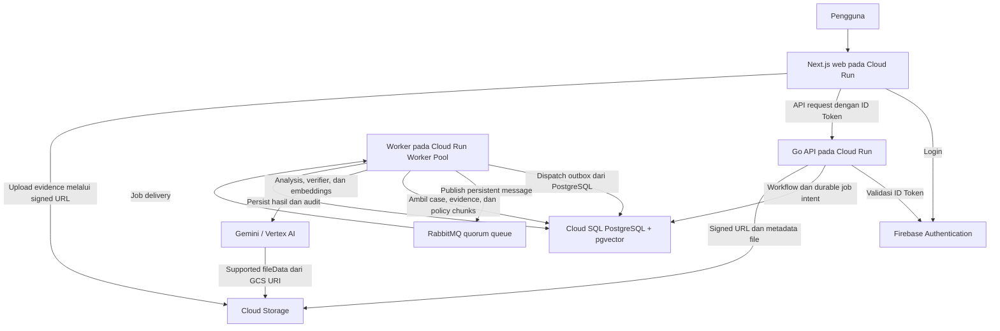

# Arsitektur dan Teknologi untuk Submission

**Untuk slide:** 8 dan 9.  
**Status:** ringkasan desain final. Deployment dan konfigurasi runtime belum diverifikasi.

## Diagram arsitektur untuk slide 8

Satu worker service menjalankan outbox dispatcher dan AI job consumer. Diagram menunjukkan dua arah message flow pada service tersebut, bukan dua service baru. Outbox adalah data PostgreSQL, bukan broker kedua.

## Penjelasan singkat diagram

Backend menyimpan state, analysis intent, audit, dan outbox dalam transaction yang sama. Dispatcher mengirim message ke RabbitMQ. Consumer memproses exact analysis_id dengan status/lease guards dan menyimpan hasil sebelum ACK. Duplicate delivery tidak boleh menghasilkan finalization ganda. External AI call berada di luar database transaction.

Policy retrieval membatasi source pada policy ACTIVE, READY, effective, dan sesuai case type atau generic policy. Evidence dan attachment diperlakukan sebagai data dengan provenance, bukan instruksi yang dapat mengubah authority.

## Teknologi untuk slide 9

| Area | Teknologi final yang terdokumentasi | Fungsi |
|---|---|---|
| Frontend | Next.js, TypeScript, Tailwind CSS | UI case, review, execution, dan history |
| Server state dan form | TanStack Query, React Hook Form, Zod | API state, input, dan validasi UX |
| Backend | Go, Chi, sqlc | API, authorization, workflow, dan persistence |
| Database | PostgreSQL pada Cloud SQL, JSONB | Case, analysis, decision, audit, dan outbox |
| Retrieval | pgvector, HNSW, cosine | Search policy chunks berdasarkan query embedding |
| AI | Gemini melalui Vertex AI | Analysis, multimodal evidence, dan verifier |
| Embedding | gemini-embedding-001, 768 dimensions | Embedding query dan policy chunk |
| Messaging | RabbitMQ quorum queue | Durable job delivery dengan publisher confirm/manual ACK |
| Authentication | Firebase Authentication | Identity dan ID Token |
| File storage | Google Cloud Storage | File evidence dan Gemini fileData reference |
| Runtime | Cloud Run Service dan Cloud Run Worker Pool | Web/API dan worker |
| Build/deployment | Docker, GitHub Actions | Pipeline yang dirancang dalam baseline |

## Detail pendukung yang tidak perlu memenuhi slide

Retrieval menggunakan top 8 chunks tanpa hard similarity threshold atau reranker kedua pada MVP. Policy domain adalah metadata, bukan hard filter karena case tidak memiliki domain field. Embedding task menggunakan RETRIEVAL_DOCUMENT untuk chunks dan RETRIEVAL_QUERY untuk query.

PDF, JPEG, dan PNG yang masuk allowlist dikirim sebagai supported Gemini fileData dengan GCS URI dan MIME type. Desain ini tidak menambahkan custom OCR pipeline.

Ringkasan ini tidak menetapkan model generation baru, harga cloud, kapasitas deployment, atau konfigurasi infrastructure yang belum diputuskan.

## Sumber

- [Architecture](../architecture/architecture.md), terutama AI context, retrieval, outbox/RabbitMQ, reliability, dan runtime.
- [Database](../database/database-design.md) untuk analysis version, worker claim, dan outbox persistence.
- [README Backend](https://github.com/jawir-team/jawir-sentinel-be/blob/main/README.md) dan [README Frontend](https://github.com/jawir-team/jawir-sentinel-fe/blob/main/README.md) untuk stack.

