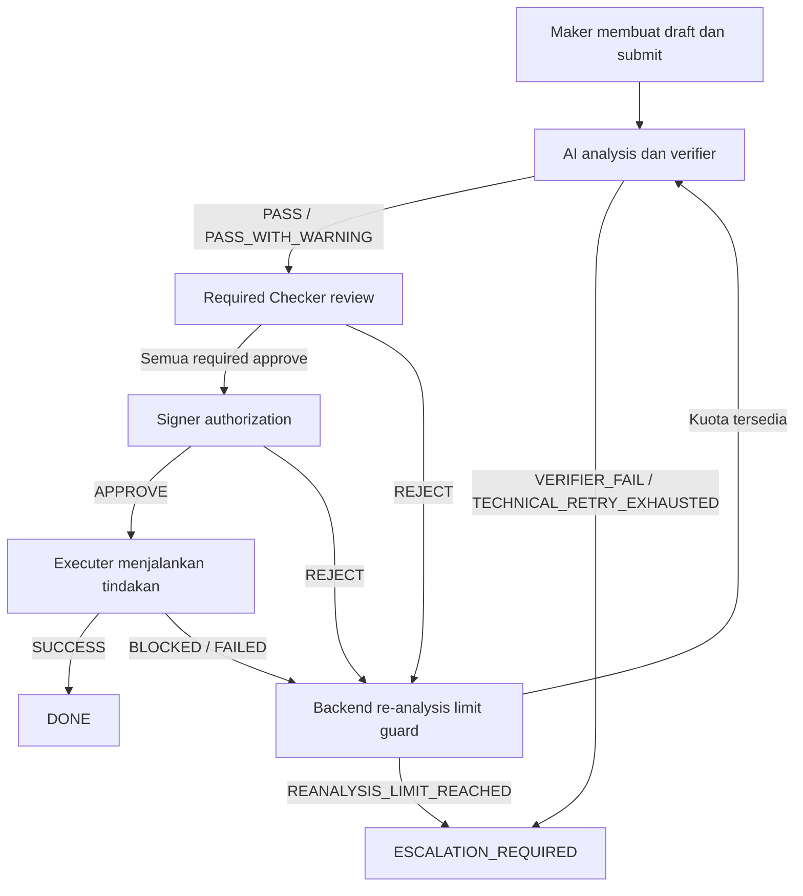

# Fitur dan Alur Use Case

**Untuk slide:** 5 dan 6.  
**Status:** capability desain final. Keberadaan spesifikasi tidak membuktikan fitur sudah berjalan.

## Daftar fitur untuk slide 5

| Fitur desain MVP | Perilaku yang ditampilkan kepada pengguna |
|---|---|
| Case dan participant | Maker membuat draft dan menetapkan Checker, Signer, serta Executer yang berbeda user |
| Evidence teks dan file | Pengguna menyertakan konteks; PDF, JPEG, dan PNG yang didukung masuk ke AI context |
| Policy retrieval | Analisis memakai applicable policy ACTIVE, READY, dan effective dengan reference section/version |
| Analisis terstruktur | Summary, facts, assumptions, unknowns, risk/compliance, recommendation, alternatif, dan uncertainty |
| Verifier | PASS/PASS_WITH_WARNING dapat direview; FAIL menghentikan automated loop untuk escalation |
| Review dan authorization | Semua required Checker menyetujui current analysis sebelum Signer mengotorisasi |
| Execution | Executer mencatat SUCCESS, BLOCKED, atau FAILED beserta evidence hasilnya |
| Governed re-analysis | Reject/BLOCKED/FAILED menghasilkan analysis baru jika kuota tersedia |
| History dan audit | Analisis, policy/evidence reference, decision, dan execution tersimpan per version |

## Diagram alur untuk slide 6

Diagram menyederhanakan state internal SUBMITTED. Limit guard berada pada backend sesuai kontrak workflow.

Approval melekat pada exact `analysis_id`. Analisis baru memerlukan review seluruh required Checker dan authorization Signer kembali. Historical decision tidak dipindahkan ke version baru.

## Batas final yang harus tetap terlihat

- Initial analysis dimulai lewat submit. Evidence baru tidak memicu analysis sendiri.
- Empat trigger re-analysis: CHECKER_REJECTED, SIGNER_REJECTED, EXECUTION_BLOCKED, EXECUTION_FAILED.
- MAX_REANALYSIS=3 berarti maksimal tiga business re-analysis setelah initial analysis. Technical retry tetap pada cycle/version yang sama dengan konfigurasi terpisah.
- Quota habis tetap menyimpan business decision/result dan feedback, kemudian menghasilkan ESCALATION_REQUIRED tanpa analysis/outbox baru.
- Escalation cause dibatasi pada VERIFIER_FAIL, TECHNICAL_RETRY_EXHAUSTED, REANALYSIS_LIMIT_REACHED.
- Policy conflict tetap assessment/verification finding; tidak menjadi standalone escalation trigger.
- Close mengikuti authorization dan ditolak selama analysis GENERATING atau execution IN_PROGRESS.

## Batas kewenangan

AI menghasilkan analysis dan recommendation. Backend memvalidasi transition. Pengguna yang assigned melakukan review, authorization, dan execution. ADMIN tidak bypass strict SoD. MVP tidak menyediakan autonomous execution atau generic manual re-analysis/resume action.

## Sumber

[Workflow](../workflow/workflow.md), [API contract](../api/api-contract.md), dan [database design](../database/database-design.md).

